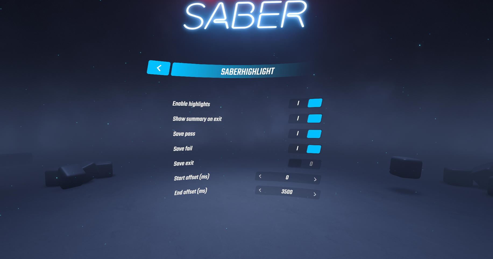

# SaberHighlight
A simple plugin that uses NVIDIA Highlight SDK to capture footage of you playing Beat Saber. Its advantage over simply using instant replay or recording the footage with something like OBS is that it automatically crops the video from map start to map fail/finish/exit. You can also use the interface in NVIDIA overlay to upload the footage directly to services like YouTube.

## Installation
Following mods are required (can be installed installed with [ModAssistant](https://github.com/Assistant/ModAssistant)):
- BSIPA
- SiraUtil
- BSML (BeatSaber Markup Language)

You will also need to place GfeSDK.dll and HighlightsPlugin64.dll to Beat Saber\Beat Saber_Data\Plugins\x86_64.

## Usage
The recording will be started automatically. If you want to save one of the recordings, you can open the summary by pressing F3 key or exiting the game.

## Download
You can always download the latest release from the [releases page](https://github.com/SamuelTulach/SaberHighlight/releases).

## Issues/constributing
If you find any issue or you have a suggestion, you can use GitHub issues. If you want to contribute, this repo is accepting pull requests.